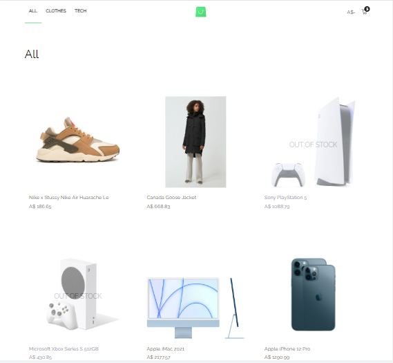
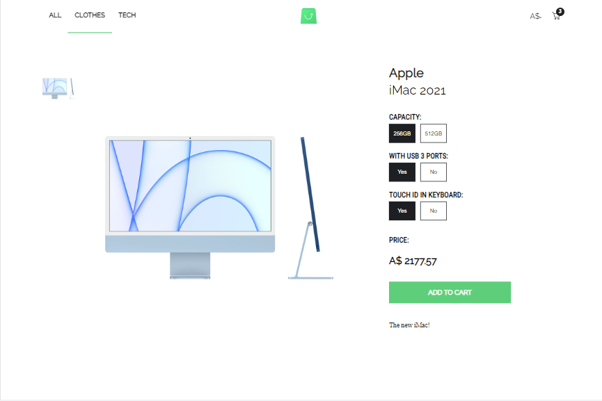
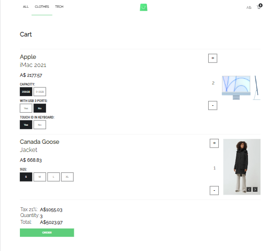
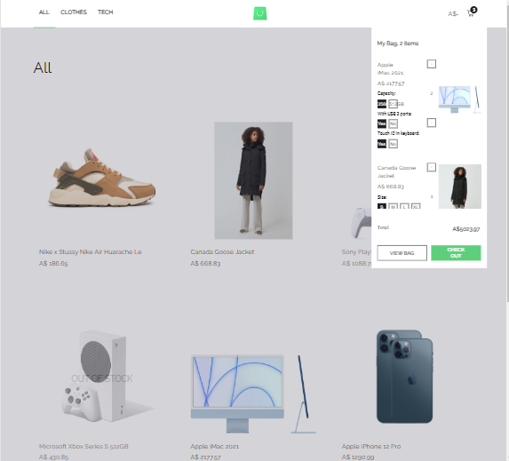

# Welcome to Store App

## Technology Stack

### `React` `Class components` `Life Cycle Methods` `React-Router-DOM` `ReactContext`
### `Styled-components` `Flexboxes`
### `GraphQL` `ApolloClient`
### `Browser API` `SessionStorage`

## End-point

[https://github.com/scandiweb/junior-react-endpoint](Click) GraphQL

## Pages

### 1.Category Items

Items are loading asyncronous and current category is stored in Session Storage so after reloadind you are at the same route.

### 2.Item Page

Item attributes looks different depending of type

### 3.Cart Page

In cart page same items with same selected attribute options are merged so you can add to cart same items with different attributes and they will shown separately 

### 4.Mini Cart

